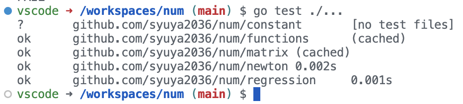
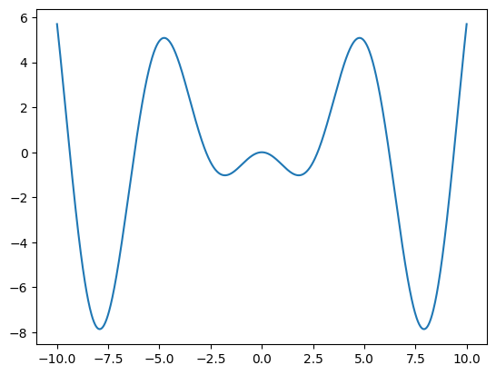
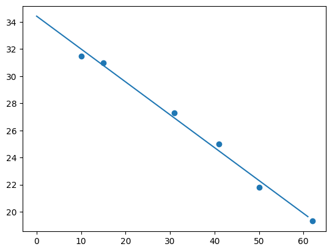

# 数値解析課題　前半

4J-15 後藤柊矢

## 課題について

この課題は、テスト駆動開発で行った。課題で与えられた問題と想定される出力値をテストケースとしてテストコードを書き、それが通るようにコードを書いた。
コードは全て私の[GitHub](https://github.com/syuya2036/num)に公開している。

また、テストは全てpassすることを確認した。

## 1. 掃き出し法・ガウスザイデル法

- ソースコード ->  [Matrix](https://github.com/syuya2036/num/blob/main/matrix/matrix.go)

- テストコード -> [MatrixTest](https://github.com/syuya2036/num/blob/main/matrix/matrix_test.go)

## 2. はさみうち法

- ソースコード -> [Pincer](https://github.com/syuya2036/num/blob/main/newton/newton.go)

- テストコード -> [PincerTest](https://github.com/syuya2036/num/blob/main/newton/newton_test.go)

- グラフ 

テストコードで適当な初期値を与えないと発散することを確かめた。

## 3. ニュートン法

- ソースコード -> [Newton](https://github.com/syuya2036/num/blob/main/newton/newton.go)

- テストコード -> [NewtonTest](https://github.com/syuya2036/num/blob/main/newton/newton_test.go)

- 表 ->[Q3 Table](https://github.com/syuya2036/num/blob/main/docs/newton.md)

## 4. 最小二乗法

- ソースコード -> [Regression](https://github.com/syuya2036/num/blob/main/regression/regression.go)

- テストコード -> [RegressionTest](https://github.com/syuya2036/num/blob/main/regression/regression_test.go)

- グラフ 

